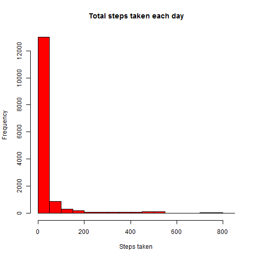
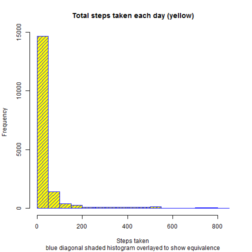
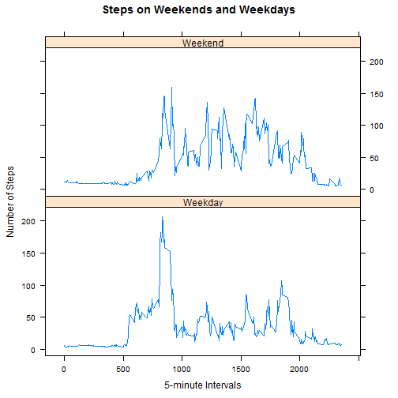

# Knitr with R Markdown
## Loading and preprocessing the data


```r
#### Optional Code -- specify work directory ###########
# setwd("Y:/Documents/Coursera/Reproducible Research/Assignment")
########################################################

download.file("https://d396qusza40orc.cloudfront.net/repdata%2Fdata%2Factivity.zip",
              dest ="data.zip")

#data will be a dataframe containing the raw data
data = read.delim(unzip("data.zip"),sep = ",",na.strings = "NA")

#data2 will be a dataframe with processed data
data2 = data
data2$steps = as.integer(data$steps)
data2$date = strptime(data$date,"%Y-%m-%d")
str(data2)
```

```
## 'data.frame':	17568 obs. of  3 variables:
##  $ steps   : int  NA NA NA NA NA NA NA NA NA NA ...
##  $ date    : POSIXlt, format: "2012-10-01" "2012-10-01" ...
##  $ interval: int  0 5 10 15 20 25 30 35 40 45 ...
```


## What is mean total number of steps taken per day?

```r
hist(data2$steps,main = "Total steps taken each day",
     ylab="Frequency",xlab="Steps taken", col="red")
```

 

```r
#mean and median:
  step.summary = summary(data2$steps)
  step.summary[c(4,3)]
```

```
##   Mean Median 
##  37.38   0.00
```
### Note, there is a large point mass at zero, so I show the histogram a second time excluding zero-step data.


```r
  hist(data2$steps[data2$steps>0],main = "Total steps excluding zeroes", ylab="Frequency",xlab="Steps taken", col="green")
```

 

## What is the average daily activity pattern?

```r
steps.by.interval = aggregate(steps~interval,data=data2,FUN=mean)
names(steps.by.interval)[2] = "Avg.steps"

plot(Avg.steps~interval,data=steps.by.interval,type="l",main="Average Steps each interval", ylab="average steps")
```

 

```r
# Print the max number of steps
max.steps = max(steps.by.interval$Avg.steps)
max.interval = steps.by.interval[steps.by.interval$Avg.steps==max.steps,]
cat("Interval #", max.interval$interval , " contains " , max.interval$Avg.steps , " steps, the maximum.",sep="")
```

```
## Interval #835 contains 206.1698 steps, the maximum.
```


## Imputing missing values
### First, we count the NA's:


```r
cat("There are",sum(is.na(data2)), "missing values")
```

```
## There are 2304 missing values
```

### Next, use the 5-min interval mean to fill in missing values:


```r
#fill "NA" step values with interval averages:
filled.steps = data2$steps
na.intervals = data.frame(data2[is.na(filled.steps),3])
names(na.intervals) = "interval"
fill.data = merge(na.intervals,steps.by.interval)
filled.steps = replace(filled.steps,is.na(filled.steps),fill.data$Avg.steps)
summary(filled.steps)
```

```
##    Min. 1st Qu.  Median    Mean 3rd Qu.    Max. 
##    0.00    0.00    0.00   37.38   27.00  806.00
```

### Create new dataset filling in missing data:

```r
data2 = cbind(data2,filled.steps)
summary(data2)
```

```
##      steps             date                        interval     
##  Min.   :  0.00   Min.   :2012-10-01 00:00:00   Min.   :   0.0  
##  1st Qu.:  0.00   1st Qu.:2012-10-16 00:00:00   1st Qu.: 588.8  
##  Median :  0.00   Median :2012-10-31 00:00:00   Median :1177.5  
##  Mean   : 37.38   Mean   :2012-10-31 00:25:34   Mean   :1177.5  
##  3rd Qu.: 12.00   3rd Qu.:2012-11-15 00:00:00   3rd Qu.:1766.2  
##  Max.   :806.00   Max.   :2012-11-30 00:00:00   Max.   :2355.0  
##  NA's   :2304                                                   
##   filled.steps   
##  Min.   :  0.00  
##  1st Qu.:  0.00  
##  Median :  0.00  
##  Mean   : 37.38  
##  3rd Qu.: 27.00  
##  Max.   :806.00  
## 
```

```r
cat("The means of both datasets should be the same. Old:", mean(data2$steps,na.rm=T),"New:",mean(data2$filled.steps))
```

```
## The means of both datasets should be the same. Old: 37.3826 New: 37.3826
```

### Compare to original histogram

```r
data2$factor.date = data$date

hist(data2$filled.steps,main = "Total steps taken each day (yellow)",
     ylab="Frequency",xlab="Steps taken", col="yellow",sub = "blue diagonal shaded histogram overlayed to show equivalence")
hist(data2$filled.steps,main = "Total steps taken each day",
     ylab="Frequency",xlab="Steps taken", col="blue",density=15,add=T)
```

 

```r
#mean and median:
  step.summary2 = summary(data2$filled.steps)
  step.summary2[c(4,3)]
```

```
##   Mean Median 
##  37.38   0.00
```

```r
  cat("For comparison, the difference between the original means and medians and those of the revised data set is",step.summary2[c(4,3)] - step.summary[c(4,3)],", respectively. This is because NA's were replaced with means of the original data.")
```

```
## For comparison, the difference between the original means and medians and those of the revised data set is 0 0 , respectively. This is because NA's were replaced with means of the original data.
```

## Are there differences in activity patterns between weekdays and weekends?
### First, differentiate weekends from weekdays.

```r
data2$day = weekdays(data2$date)
data2$weekday.or.weekend = data2$day
is.weekend = data2$weekday.or.weekend %in% c("Sunday","Saturday")
data2$weekday.or.weekend = replace(data2$weekday.or.weekend,is.weekend,"Weekend")
data2$weekday.or.weekend = replace(data2$weekday.or.weekend,!is.weekend,"Weekday")
data2$weekday.or.weekend = as.factor(data2$weekday.or.weekend)
cat("Number of weekdays and weekends respectively:",summary(data2$weekday.or.weekend))
```

```
## Number of weekdays and weekends respectively: 12960 4608
```
### Next plot steps by weekend/ weekday

```r
require(lattice)
summary.data = aggregate(filled.steps~interval+weekday.or.weekend, data=data2, FUN=mean)
xyplot(filled.steps ~ interval | weekday.or.weekend, data = summary.data, layout = c(1, 2), type = "l",
       xlab="5-minute Intervals", ylab="Number of Steps",
       main="Steps on Weekends and Weekdays")
```

 


```
## 
## 
## processing file: PA1_template.Rmd
```

```
## Error in parse_block(g[-1], g[1], params.src): duplicate label 'load_data'
```
